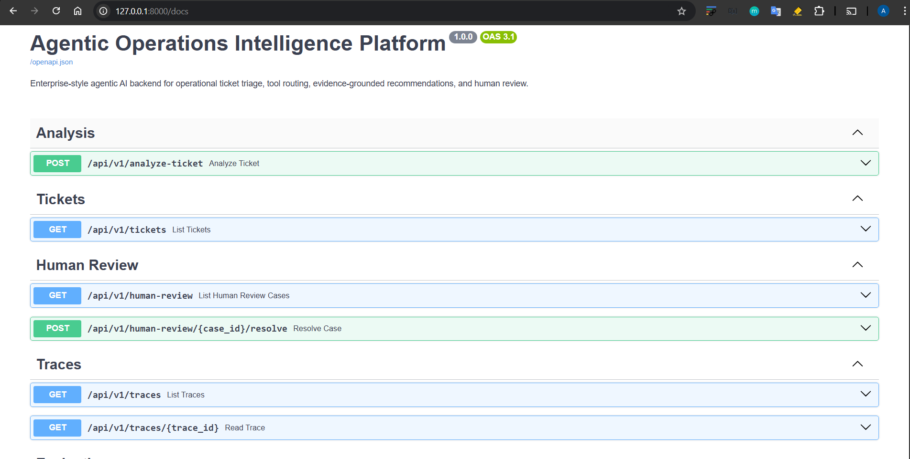
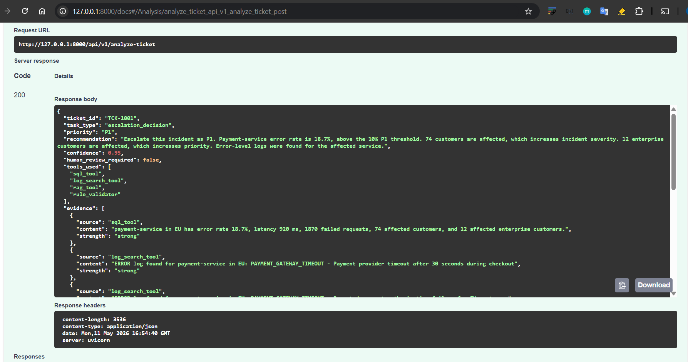
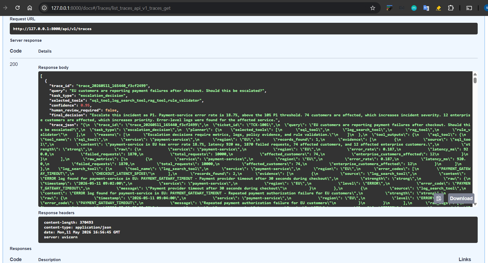
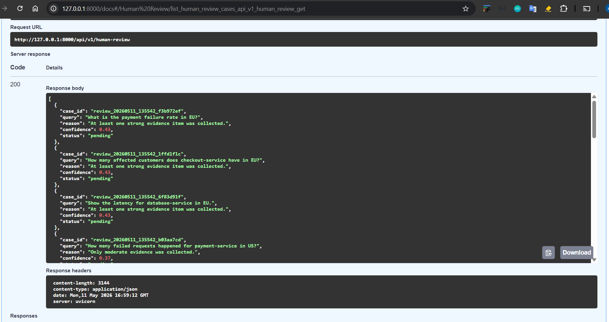
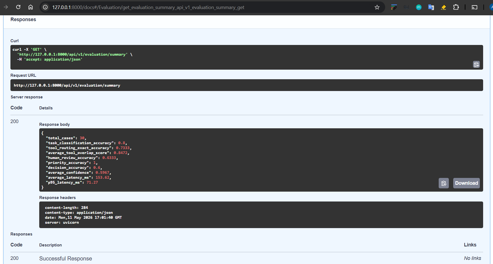
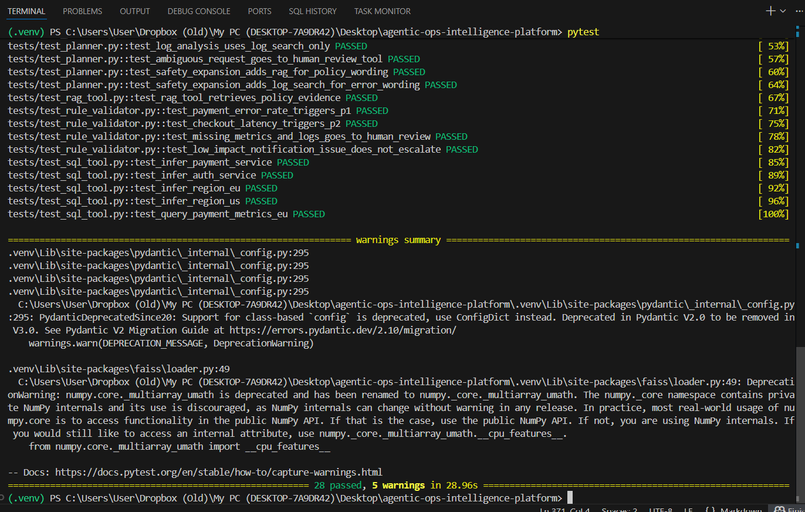

# Agentic Operations Intelligence Platform

Enterprise-style AI backend for operational ticket triage, incident investigation, evidence-grounded recommendations, and human-review routing.

This project demonstrates how an agentic AI system can decide whether an operational request requires SQL analysis, log search, document retrieval, rule-based validation, or human review. Unlike a basic RAG chatbot, the system performs a controlled decision workflow with tool routing, evidence verification, confidence scoring, trace logging, and benchmark evaluation.

---

## Problem

Companies handle operational tickets, incident reports, service metrics, logs, policies, and runbooks every day.

A normal RAG chatbot can retrieve documents, but real operational decisions often require multiple evidence sources.

Example ticket:

```text
EU customers are reporting payment failures after checkout. Should this be escalated?
```

A useful AI system should check:

```text
- service metrics
- operational logs
- SLA policies
- escalation rules
- confidence level
- need for human review
```

---

## What the System Does

Given a ticket or operational query, the system:

1. Classifies the request type
2. Plans which tools are required
3. Routes the request to selected tools
4. Collects evidence from SQL, logs, and documents
5. Applies escalation rules
6. Calculates confidence
7. Sends uncertain cases to human review
8. Stores a full trace of the decision

---

## Architecture

```text
FastAPI API
   |
   v
LangGraph Agent Workflow
   |
   +--> Task Classifier
   +--> Planner
   +--> Tool Router
          |
          +--> SQL Tool
          +--> Log Search Tool
          +--> RAG Tool
          +--> Rule Validator
          +--> Human Review Tool
   |
   +--> Evidence Verifier
   +--> Confidence Scorer
   +--> Response Generator
   +--> Trace Logger
```

---

## Example Output

Request:

```json
{
  "query": "EU customers are reporting payment failures after checkout. Should this be escalated?",
  "ticket_id": "TCK-1001"
}
```

Response:

```json
{
  "ticket_id": "TCK-1001",
  "task_type": "escalation_decision",
  "priority": "P1",
  "recommendation": "Escalate this incident as P1. Payment-service error rate is 18.7%, above the 10% P1 threshold. Error-level logs were found for the affected service.",
  "confidence": 0.95,
  "human_review_required": false,
  "tools_used": [
    "sql_tool",
    "log_search_tool",
    "rag_tool",
    "rule_validator"
  ],
  "matched_rules": [
    "payment_failure_rate_above_10_percent",
    "affected_customers_above_50",
    "enterprise_customers_above_10",
    "error_logs_present"
  ],
  "trace_id": "trace_..."
}
```

---

## Tool Routing

| Query Type | Example | Selected Tools |
|---|---|---|
| Escalation decision | “Should EU payment failures be escalated?” | SQL, logs, RAG, rules |
| Policy lookup | “What does the SLA policy say?” | RAG |
| Metrics lookup | “What is the payment failure rate in EU?” | SQL |
| Log analysis | “Find timeout errors in payment logs.” | Log search |
| Ambiguous request | “Something seems wrong.” | Human review |

---

## Key Features

- FastAPI backend
- LangGraph-based workflow orchestration
- Dynamic tool routing
- SQL tool for structured service metrics
- Log search tool for operational errors
- RAG tool for policies and runbooks
- Rule-based escalation validator
- Evidence quality verification
- Confidence scoring
- Human-review fallback
- Trace logging for auditability
- Benchmark evaluation
- Pytest test suite
- Dockerized local deployment

---

## Tech Stack

```text
Python
FastAPI
LangGraph
SQLAlchemy
SQLite
Pydantic
Sentence Transformers
FAISS
Pandas
Pytest
Docker
```

---

## Run Locally

Create and activate a virtual environment:

```bash
python -m venv .venv
```

Windows PowerShell:

```bash
.\.venv\Scripts\Activate.ps1
```

Linux/macOS:

```bash
source .venv/bin/activate
```

Install dependencies:

```bash
pip install -r requirements.txt
```

Seed the database:

```bash
python -m app.db.seed
```

Build the retrieval index:

```bash
python -m app.retrieval.build_index
```

Run the API:

```bash
uvicorn app.main:app --reload
```

Open Swagger UI:

```text
http://127.0.0.1:8000/docs
```

---

## Run with Docker

```bash
docker compose up --build
```

Then open:

```text
http://127.0.0.1:8000/docs
```

---

## Evaluation

Run:

```bash
python -m evaluation.run_evaluation
```

The evaluation measures:

```text
task classification accuracy
tool routing accuracy
human-review accuracy
priority accuracy
decision accuracy
average latency
p95 latency
```

Generated files:

```text
evaluation/results.csv
evaluation/metrics_summary.json
evaluation/error_analysis.md
```

---

## Testing

Run:

```bash
pytest
```

Test coverage includes:

```text
classifier
planner
SQL tool
RAG tool
rule validator
API endpoints
human-review behavior
trace generation
```

Expected result:

```text
28 passed
```

---

## Screenshots













```

---

## Design Decisions

Key design choices:

- SQL is used for structured metrics.
- Log search is used for operational events.
- RAG is used for policies and runbooks.
- Escalation logic is handled by deterministic rules.
- Low-confidence or ambiguous cases go to human review.
- Every request is stored as a trace for auditability.
- Evaluation measures workflow behavior, not only final text output.

Detailed docs:

```text
docs/architecture.md
docs/design_decisions.md
docs/agent_workflow.md
docs/evaluation_methodology.md
docs/failure_cases.md
docs/production_considerations.md
```

---

## Future Improvements

Potential production extensions:

```text
PostgreSQL instead of SQLite
Qdrant or pgvector instead of FAISS
OpenTelemetry tracing
authentication and RBAC
GitHub Actions CI
larger benchmark dataset
hybrid search and reranking
human-review dashboard
integration with Jira, ServiceNow, Datadog, or Grafana
```

---

\end{itemize}
```
